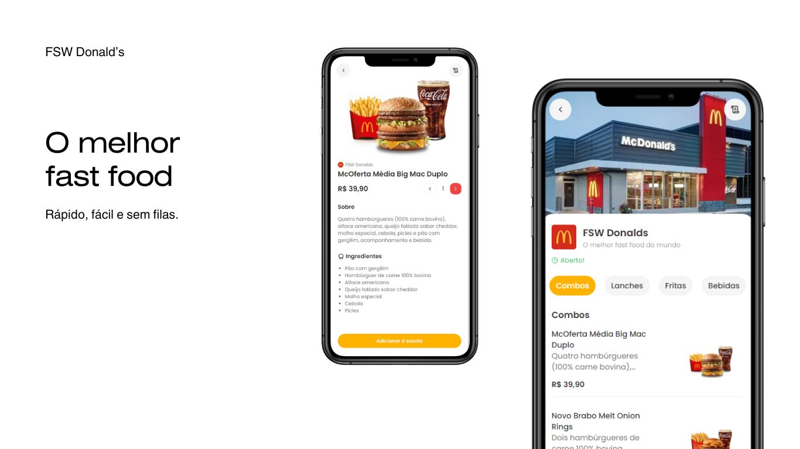

# FSW Donald's - Self Checkout com Next.js



This is a [Next.js](https://nextjs.org) project bootstrapped with [`create-next-app`](https://nextjs.org/docs/app/api-reference/cli/create-next-app).

Para acessar o site, basta entrar neste link: https://fullstackweek-donalds-eight.vercel.app/fsw-donalds

# ✨ Sobre o Projeto

O FullStackWeek Donald’s é um projeto desenvolvido com Next.js, React.js, TypeScript e TailwindCSS para criar uma experiência moderna de self checkout em fast food. O usuário pode navegar pelo menu, selecionar seus pedidos e realizar pagamentos diretamente pelo site, sem necessidade de filas ou interação com atendentes.

# 🛠 Tecnologias Utilizadas

Next.js - Framework React para renderização eficiente e otimização de SEO

React.js - Biblioteca para construção de interfaces dinâmicas e reativas

TypeScript - Tipagem estática para maior segurança e produtividade

TailwindCSS - Estilização otimizada com classes utilitárias

Bootstrap - Framework CSS para construção de layouts responsivos e acessíveis

Stripe - Integração para processamento de pagamentos online

JavaScript - Lógica de interatividade e manipulação de dados

Node.js - Backend para lidar com requisições e processamentos do servidor

# 💻 Como Clonar e Rodar o Projeto Localmente

## 📥 Pré-requisitos

Antes de começar, certifique-se de ter instalado em sua máquina:

Node.js (versão recomendada: 16+)

NPM ou Yarn para gerenciar pacotes

Git para clonar o repositório

# 📌 Passos para Instalação

## Clone o repositório

`git clone https://github.com/seu-usuario/fullstackweek-donalds.git´

Acesse o diretório do projeto

`cd fullstackweek-donalds´

Instale as dependências:

```bash
npm install
# ou
yarn install
```

Inicie o servidor local

```bash
npm run dev
# ou
yarn dev
```

Acesse no navegador
Abra seu navegador e digite:

`http://localhost:3000´

# 💡 Como Contribuir

## Gostaria de contribuir com melhorias no projeto? Siga os passos abaixo:

Faça um fork do repositório

Crie uma branch para sua feature:

`git checkout -b minha-nova-feature´

Realize suas alterações e faça commits

`git commit -m "Adiciona nova feature X"´

Envie suas alterações para o GitHub

`git push origin minha-nova-feature´

## Abra um Pull Request e descreva as melhorias que você fez

# 💳 Fluxo de Funcionamento

1 - O usuário acessa o site e visualiza o cardápio de produtos

2 - Escolhe os itens desejados e adiciona ao carrinho, com seu Nome e CPF

3 - Finaliza a compra através do Stripe, utilizando cartão de crédito

4 - O pedido é processado e enviado para preparação

# 🌟 Diferenciais

• Interface moderna e responsiva para melhor experiência do usuário

• Processo de compra simplificado e rápido

• Pagamento seguro com Stripe

• Código otimizado para performance e escalabilidade

• Autenticação para pedidos personalizados

• Integração com banco de dados para controle de pedidos

• Histórico de compras para usuários logados

Check out our [Next.js deployment documentation](https://nextjs.org/docs/app/building-your-application/deploying) for more details.
